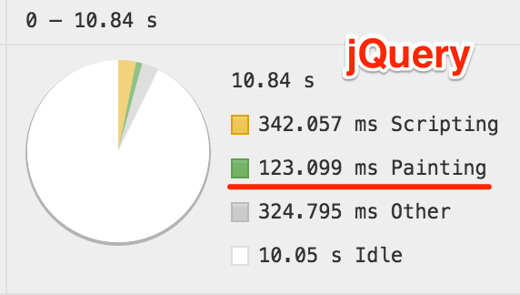
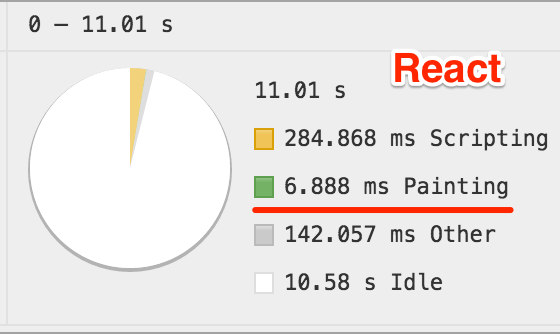
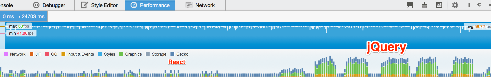

# React Thumb Preview

[](https://www.npmjs.org/package/thumb-preview)

A React component that provides a thumbnail preview effect controlled by
mousemove events.

## Usage

Install it via **npm**:

```
npm install thumb-preview --save
```

Then call the `ThumbPreview` component, passing the image
paths via the `images` props:

```javascript
var images =  ["/path/to/image_1.jpg",
  "/path/to/image_2.jpg", "/path/to/image_3.jpg"]

React.render(<ThumbPreview images={images} />, targetElement);
```

This is a port from the [jQuery-Thumb-Preview](https://github.com/caike/jQuery-Thumb-Preview) plugin

## Examples

Check `index.html` for a comparison between the [original jQuery plugin](https://github.com/caike/jQuery-Thumb-Preview)
and this component.

I've run some benchmarks in Chrome 43.0.2357.130 (64-bit)
and Firefox 38.0.5:

### Chrome



### Firefox

